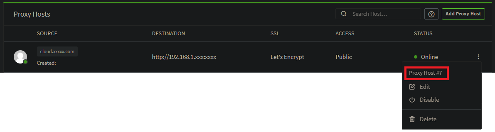
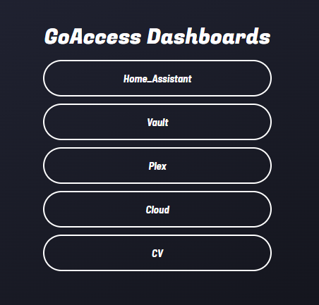

#  GoAccess-NPM-Portal

<div align="center">
  
[](https://hub.docker.com/r/pekno/goaccess-npm-portal)
  
</div>


## Description

This project is a customized version of the original [goaccess-for-nginxproxymanager](https://github.com/xavier-hernandez/goaccess-for-nginxproxymanager) by [xavier-hernandez](https://github.com/xavier-hernandez). It leverages GoAccess to create a dynamic and multi-instance dashboard, providing detailed analytics for different subdomains, with each dashboard running on its dedicated port and managed by Nginx.

## Features

- **Multi-Instance GoAccess**: Create multiple instances of GoAccess, each dedicated to a specific subdomain (e.g., Home_Assistant, Vault, Plex, etc.).
- **Customizable Dashboard Map**: Define an environment variable to map `Proxy IDs` to dashboard names.
> [!TIP]
> You can find the associated `Proxy ID` from the Proxy Host list, by clicking the `...`
> 
- **Landing Page**: A landing page is available at the root URL (`/`), displaying all available dashboards with clickable links for easy navigation to each one.



## Configuration

- You can configure your subdomains and associated dashboards by editing the `DASHBOARD_MAP` environment variable (e.g., `"1=Home_Assistant,3=Vault,4=Plex,11=CV,7=Cloud"`).
- Nginx automatically routes traffic to each GoAccess instance based on the subdomain mapping.

## Installation

Make sure to mount the directory containing your log files to the `/opt/log` directory in the Docker container. The log files are needed for GoAccess to generate the dashboards.

Example:

```bash
docker run -v /path/to/your/logs:/opt/log -p 7880:7880 -e DASHBOARD_MAP="1=Home_Assistant,3=Vault,4=Plex,11=CV,7=Cloud" -d pekno/goaccess-npm-portal:latest
```

A Docker image is also available via [Docker Hub](https://hub.docker.com/r/pekno/goaccess-npm-portal).

## Ideas / To do

- [ ] Issue when removing new Dashboard to the map
- [ ] Add Favico


## Credits

- This project is based on the original [goaccess-for-nginxproxymanager](https://github.com/xavier-hernandez/goaccess-for-nginxproxymanager) by [xavier-hernandez](https://github.com/xavier-hernandez). Big thanks to him for the inspiration and base implementation.

---
