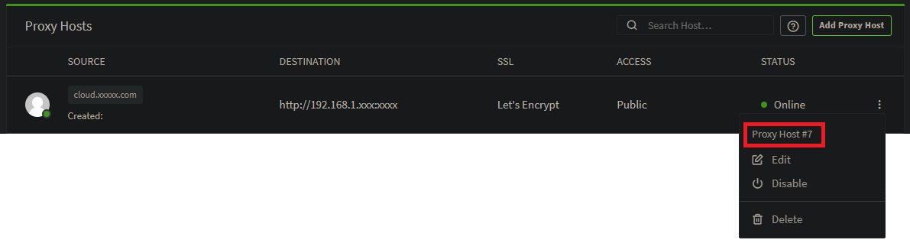
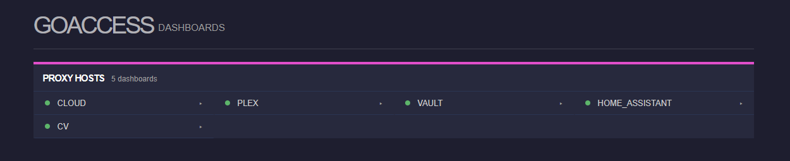

#  GoAccess-NPM-Portal

<div align="center">
  

[](https://hub.docker.com/r/pekno/goaccess-npm-portal)

</div>

## Description

This project is a customized version of the original [goaccess-for-nginxproxymanager](https://github.com/xavier-hernandez/goaccess-for-nginxproxymanager) by [xavier-hernandez](https://github.com/xavier-hernandez). It leverages GoAccess to create a dynamic and multi-instance dashboard, providing detailed analytics for different subdomains, with each dashboard running on its dedicated port and managed by Nginx.

## Features

- **Multi-Instance GoAccess**: Create multiple instances of GoAccess, each dedicated to a specific subdomain (e.g., Home_Assistant, Vault, Plex, etc.).
- **Customizable Dashboard Map**: Define an environment variable to map `Proxy IDs` to dashboard names.
> [!TIP]
> You can find the associated `Proxy ID` from the Proxy Host list, by clicking the `...`
> 
- **Landing Page**: A landing page is available at the root URL (`/`), displaying all available dashboards with clickable links for easy navigation to each one.



## Configuration

- You can configure your subdomains and associated dashboards by editing the `DASHBOARD_MAP` environment variable (e.g., `"1=Home_Assistant,3=Vault,4=Plex,11=CV,7=Cloud"`).
- Nginx automatically routes traffic to each GoAccess instance based on the subdomain mapping.
- **`WEBUI_PORT`**: (Optional) The internal port on which the main Nginx web UI (landing page) will listen. Defaults to `7880`. If you change this, you'll need to adjust your `docker run -p` mapping accordingly. For example, if you set `WEBUI_PORT=8080`, you would use `-p <host_port>:8080`.

## Building

The GoAccess version can be selected at build time via the `GOACCESS_VERSION` build arg (defaults to `1.10.1`):

```bash
# Default version
docker build -t goaccess-npm-portal .

# Specific version
docker build --build-arg GOACCESS_VERSION=1.9.3 -t goaccess-npm-portal .
```

## Installation

Make sure to mount the directory containing your log files to the `/opt/log` directory in the Docker container. The log files are needed for GoAccess to generate the dashboards.

Example:

```bash
docker run
    -v /path/to/your/logs:/opt/log
    -p 7880:7880
    -e DASHBOARD_MAP="1=Home_Assistant,3=Vault,4=Plex,11=CV,7=Cloud" 
    -d pekno/goaccess-npm-portal:latest
```

To use a different port for the web UI, for example, 8080 on the host mapped to an internal 8000:
```bash
docker run 
    -v /path/to/your/logs:/opt/log 
    -p 8000:8000 
    -e WEBUI_PORT=8000
    -e DASHBOARD_MAP="1=Home_Assistant,3=Vault,4=Plex,11=CV,7=Cloud" 
    -d pekno/goaccess-npm-portal:latest
```

**Important Considerations:**

*   **Port Conflicts:** The `WEBUI_PORT` is for the main Nginx instance that serves the landing page and proxies to the individual GoAccess reports. The GoAccess instances themselves run on different ports, starting from `goaccess_port_start=7890` (as defined in `start.sh`) and incrementing for each dashboard. Ensure that the `WEBUI_PORT` you choose doesn't conflict with these internal GoAccess ports or any other ports you might be using.
*   **Docker Port Mapping:** Remember that `EXPOSE` in the Dockerfile doesn't automatically publish the port. You always need to use the `-p <host_port>:<container_port>` option with `docker run`. If you set `WEBUI_PORT=8000` in your environment variables, your `docker run` command must use `-p <your_host_port>:8000` to correctly map to the new internal port.

A Docker image is also available via [Docker Hub](https://hub.docker.com/r/pekno/goaccess-npm-portal).

## Ideas / To do

- [ ] Add Favico

## Credits

- This project is based on the original [goaccess-for-nginxproxymanager](https://github.com/xavier-hernandez/goaccess-for-nginxproxymanager) by [xavier-hernandez](https://github.com/xavier-hernandez). Big thanks to him for the inspiration and base implementation.

---
